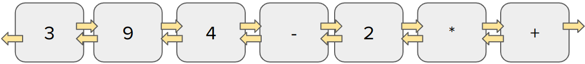
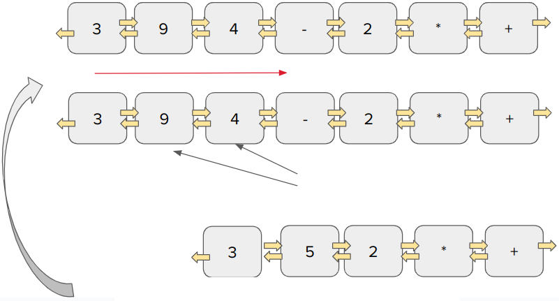
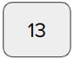

# Cálculo de Expressões na Ordem Polonesa Reversa com Lista Duplamente Encadeada

A notação tradicional de expressões aritméticas possui uma ambiguidade que obriga o uso de parênteses:


É chamada de notação tradicional complemente parentizada quando temos um par de parênteses para cada operação:

- Notação tradicional: `A × B - C/D`
- Notação complemente parentizada: `((A × B) - (C/D))`

O número total de parênteses é igual ao número total de operações.

Na **notação polonesa**, os operadores vêm antes dos operandos, em cada operação. A notação explicita quais operadores, e em que ordem, devem ser calculados, o que dispensa o uso de parênteses, eliminando a ambiguidade.

Por exemplo:

- Notação tradicional: `A × ((B - C) / D)`
- Notação polonesa: `× A / - B C D`

Na **notação polonesa reversa** os operadores aparecem após os operandos. É utilizada em vários equipamentos eletrônicos, como calculadoras e computadores. O ordem dos operandos na notação tradicional e na notação polonesa (reversa ou não) é idêntica. Os operadores aparecem na ordem em que devem ser calculados.

Exemplo:

- Notação tradicional: `A × ((B - C) / D)`
- Notação polonesa reversa: `A B C - D / ×`

Desenvolva um programa que, dada uma string contendo uma expressão na notação tradicional completamente parentizada, como:

```text
(3+((9-4)*2))
```

1. Crie uma lista duplamente encadeada com os objetos na ordem polonesa reversa:
    
2. Resolva a operação aritmética percorrendo a lista duplamente encadeada:
     1. percorrer a lista duplamente encadeada até encontrar um operador;
     2. os dois elementos exatamente anteriores a ele são os operandos. Resolva a operação, elimine os 3 objetos, e substitua-os por apenas um objeto com o resultado da operação;
     3. retorne ao passo 1 enquanto não tiver chegado ao fim da lista.
    
3. Devolva o valor calculado:

    

## Input Specification

Uma string contendo uma expressão aritmética `E` na forma completamente parentizada.

## Output Specification

Um valor correspondente ao cálculo da expressão. O algoritmo deve primeiro converter a expressão aritmética `E` na forma de ordem polonesa reversa e calcular o valor da expressão através do uso de uma lista duplamente encadeada.

## Observações

1. Não é permitido o uso de funções e bibliotecas prontas de Python:
   1. Pilhas e Listas Duplamente Encadeadas devem ser implementadas usando objetos/ponteiros.
   2. Atenção para a operação de divisão e subtração cuja ordem dos operandos importa.
2. Na resolução da questão, crie uma função para **imprimir a expressão na notação polonesa reversa** (ou seja, imprima a lista duplamente encadeada). Esta função pode ser chamada para checarmos se a lista foi gerada corretamente.
3. **Todas as operações** (+:soma, -: subtração, /:divisao,*:multiplicacao,%:módulo,^:potenciação) são **binárias**, i.e. possuem necessariamente 2 operandos.

## Examples

### Sample #1

#### Input

```text
(3/(6*4))
```

#### Notação Polonesa Reversa

```text
3 6 4 * /
```

#### Output

```text
0.125
```

### Sample #2

#### Input

```text
(((3+(3+5))/(9+(4-1)))/(((5*1)*1)-((9-5)*4)))
```

#### Notação Polonesa Reversa

```text
3 3 5 + + 9 4 1 - + / 5 1 * 1 * 9 5 - 4 * - /
```

#### Output

```text
-0.08333333333333333
```
